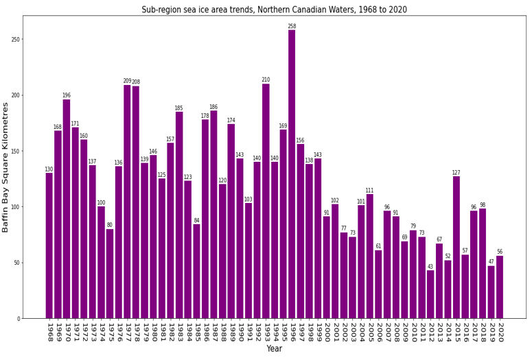

# Animal Migration and Climate Change

## Main Project Objective

The primary goal of this project is to investigate the influence of climate change on the migration patterns of the Arctic fox on Bylot Island in Greenland.

## Factors of Focus

1. **CO2 Emissions**
2. **Sea Ice Area**
3. **Temperature**
4. **Food Insecurity**

## Background Information

### Animal Proxy

- **Species:** Arctic Fox
- **Habitat:** Arctic Tundra, primarily Bylot Island
- **Behavior:** Seasonal migrant, with a tendency to stay local around Bylot Island
- **Predator:** Lemmings, hares, birds, fish, etc.

### Climate Data

#### Factor 1: CO2 Emissions

- Analyzed CO2 and greenhouse gas data.
- Greenland and Canada both experienced a decrease in CO2 levels.
- Suggests a potential correlation with animal migration.

#### Sea Ice Area Data

- **Indicator Source:** Environment and Climate Change Canada's Climate Research Division.
- **Trend:** Statistically significant decrease in summer sea ice area (1968-2020) for all sub-regions.
- **Impact:** Affects Indigenous communities, travel, and animal habitats.

#### Temperature

- **Observation:** The Arctic is warming four times faster than the global average.
- **Data:** Shows a gradual temperature increase with fluctuations.
- **Impact:** Even small temperature increases are detrimental to the environment.

#### Food Insecurity

- **Impact:** Lemming(Main Food Source of Arctic Foxes) populations affected by climate change, impacting the Arctic fox's food source.
- **Data:** Bar graph of lemming nests recorded in Bylot Island (2007-2019).

## Migration Visualization

- **Data Source:** Argos tracking from movebank.org (2007-2021).
- **Details:** 170 Arctic foxes, 64489 records.
- **Cleaning:** Extracted relevant columns, converted timestamp, added seasonal classification.
- **Distribution:** Visualized month-wise and year-wise fox movement records.

## Reflections

- **Challenges:**
  - Limited data for the Canadian Arctic Archipelago.
  - Reliance on surrogate data from lower Canada or Greenland.
  - Short lifespan of Arctic foxes impacts longitudinal data.

- **Importance:**
  - Climate change impacts food sources, sea ice, and habitat isolation.
  - Increased susceptibility to illness and reduced genetic diversity.
  - Implications for the broader ecosystem.

## Future Work

- Conduct additional studies with a larger sample size.
- Explore migration patterns of different animal types.
- Consider animals with longer lifespans for clearer migration patterns.

## References

[Link to Bowdoin College](https://courses.bowdoin.edu/gov-2577-spring-2021-managing-the-effects-of-climate-change/arctic-issues-and-policy-ideas/kiera-dent/)

[Link to Canada Daily Climate Data](https://climate-change.canada.ca/climate-data/#/daily-climate-data)

[Link to Kaggle Dataset - Eighty Years of Canadian Climate Data](https://www.kaggle.com/datasets/aturner374/eighty-years-of-canadian-climate-data)
