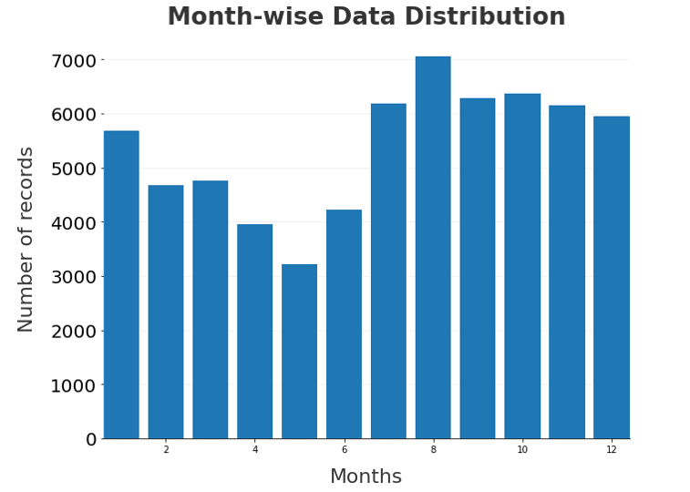
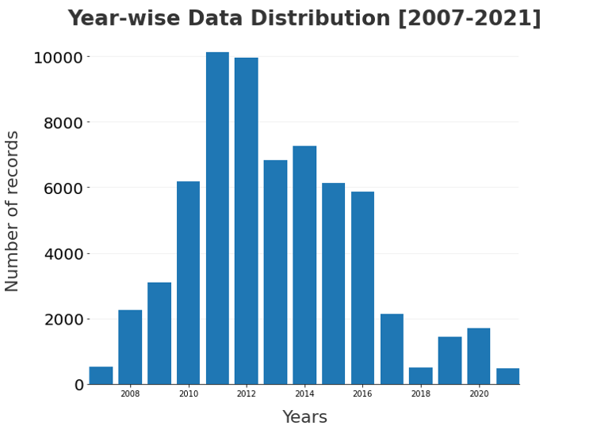
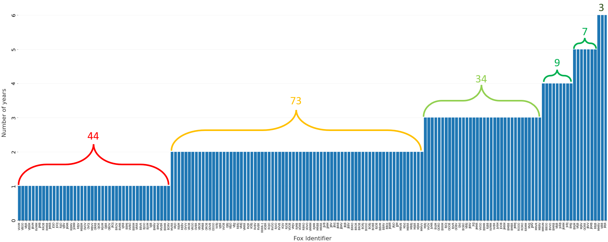
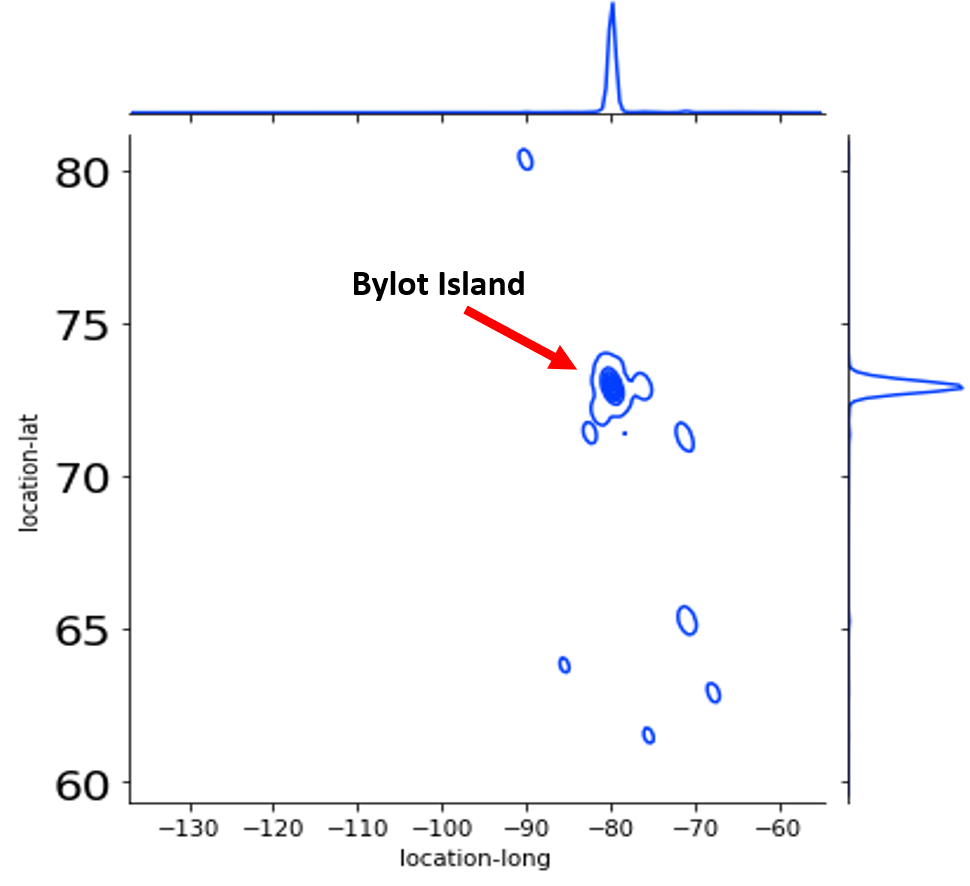

# Animal Migration and Climate Change

## Main Project Objective

The primary goal of this project is to investigate the influence of climate change on the migration patterns of the Arctic fox on Bylot Island in Greenland.

## Factors of Focus

1. **CO2 Emissions**
2. **Sea Ice Area**
3. **Temperature**
4. **Food Insecurity**

## Background Information

### Animal Proxy

- **Species:** Arctic Fox
- **Habitat:** Arctic Tundra, primarily Bylot Island
- **Behavior:** Seasonal migrant, with a tendency to stay local around Bylot Island
- **Predator:** Lemmings, hares, birds, fish, etc.

### Climate Data

#### Factor 1: CO2 Emissions

- Analyzed CO2 and greenhouse gas data.
- Greenland and Canada both experienced a decrease in CO2 levels.
- Suggests a potential correlation with animal migration.

#### Sea Ice Area Data

- **Indicator Source:** Environment and Climate Change Canada's Climate Research Division.
- **Trend:** Statistically significant decrease in summer sea ice area (1968-2020) for all sub-regions.
- **Impact:** Affects Indigenous communities, travel, and animal habitats.

#### Temperature

- **Observation:** The Arctic is warming four times faster than the global average.
- **Data:** Shows a gradual temperature increase with fluctuations.
- **Impact:** Even small temperature increases are detrimental to the environment.

#### Food Insecurity

- **Impact:** Lemming(Main Food Source of Arctic Foxes) populations affected by climate change, impacting the Arctic fox's food source.
- **Data:** Bar graph of lemming nests recorded in Bylot Island (2007-2019).
- Lemmings are well-known to have cyclic populations. Every four years, there is a large increase in population.
  The bar graph fluctuations is consistent with the lemming cyclic population. 

## Migration Visualization

- **Data Source:** Argos tracking from movebank.org (2007-2021). [Link to Movebank Study](https://www.movebank.org/cms/webapp?gwt_fragment=page=studies,path=study942774711)
- **Details:** 170 Arctic foxes, 64489 records.
- **Cleaning:** Extracted relevant columns, converted timestamp, added seasonal classification.

### Data Distribution
- **Month-Wise:** 
  - **Largest:** August has the greatest number of records at about 7000.
  - **Smallest:** May has the lowest number of records at about 3300.
- **Year-Wise:** 
  - **Largest:** 2011 and 2012 have the greatest number of records at about 10000.
  - **Smallest:** 2007, 2018, and 2021 have the lowest number of records at <1000.

---
- What is the Longest Number of Years a Specific Fox has been Recorded?
  - Three foxes were recorded for six years. (The longest number of years)
  - 73 foxes were recorded for two years. (The average number of years)
  - 44 foxes were recorded for only one year. (The smallest number of years)

---

- What is the Number of Foxes Tracked Every Year?
  - The maximum number of foxes being tracked in the year 2011, and the least number in 2021.
  - If we look closely, this graph is correlated to the year-wise data distribution of records graph.
  - As number of foxes increases, number of data points increases.

---  

- Bylot Island during Winter (March 2012) vs Bylot Island during Summer (July 2012)
  

  - During the summer months, Arctic foxes collect a surplus of food and carry it back to their dens to bury and store.*
  - During winter, Arctic foxes do sometimes move to other regions when and if the population of their prey reduces or fluctuates in the winter.
---
-  Movement of Foxes in Winter vs Summer over the Years

  - Winter Months: November, December, January, and February
    - Foxes migrating through coastal areas and sea ice looking for their main food, lemmings, or alternate marine food. We can see that locations are spread-out, which means foxes travel further from their local territory during winter.
  
  - Summer Months : June, July, August, and September
    - Almost all foxes are on the land, and fewer are on sea ice during summer. We see many clusters (red circles), and not as many foxes are spread-out, which likely means that foxes stay in dens during summer.
---
- Distribution Plot to Identify Home/Local Territory and Other Hotspots

  - We can identify the local territory and other hotspots where foxes reside using Joint plot.
  - In given joint plot, x-axis and y-axis are longitude and latitude distribution, Respectively.
  - From graph we can say that most foxes have been recorder near –80° longitude coordinates and near 73° latitude coordinates.
  - Therefore, It is safe to say that outer line around the dense dot is their local territory.
  - Also, we can see few circles at lower latitude, those are some hotspots formed when many foxes started moving towards south-east after 2015.

---

### Interactive Map to Analyze the Movement of Foxes over the Years
  -   Based on their three movement types identified:
      - Resident – foxes remain in their territories with possible commuting trips.
      - Loop Migrant - foxes leave for a least one loop migration and return to their territory
      - Nomad Migrant - foxes leave and do not return to their territory before summer starts or die while undertaking a nomadic movement 

[View interactive map](Visualizations/mapplot.html)

---

## Reflections

- **Challenges:**
  - Limited data for the Canadian Arctic Archipelago.
  - Reliance on surrogate data from lower Canada or Greenland.
  - Short lifespan of Arctic foxes impacts longitudinal data.

- **Importance:**
  - Climate change impacts food sources, sea ice, and habitat isolation.
  - Increased susceptibility to illness and reduced genetic diversity.
  - Implications for the broader ecosystem.

## Future Work

- Conduct additional studies with a larger sample size.
- Explore migration patterns of different animal types.
- Consider animals with longer lifespans for clearer migration patterns.

## References

1. Bowdoin College. (2021). Arctic Foxes in a Changing Environment. Managing the Effects of Climate Change. Retrieved November 27, 2022, from [Bowdoin College](https://courses.bowdoin.edu/gov-2577-spring-2021-managing-the-effects-of-climate-change/arctic-issues-and-policy-ideas/kiera-dent/)

2. Canada. Daily Climate Data. Retrieved November 18, 2022, from [Canadian Climate Data](https://climate-change.canada.ca/climate-data/#/daily-climate-data)

3. Domine, F., Gauthier, G., Vionnet, V., Fauteux, D., Dumont, M., & Barrere, M. (2018). Snow physical properties may be a significant determinant of lemming population dynamics in the High Arctic. Arctic Science, 4(4), 813–826. [https://doi.org/10.1139/as-2018-0008](https://doi.org/10.1139/as-2018-0008)

4. Fauteux, D. (2015, May 5). Seasonal demography of a cyclic lemming population in the Canadian Arctic. Retrieved November 26, 2022, from [Wiley Online Library](https://besjournals.onlinelibrary.wiley.com/doi/10.1111/1365-2656.12385)

5. Horobin, A. (2022, August 24). Cute But Tough - The Arctic Fox. Yukon Wildlife Preserve. Retrieved November 15, 2022, from [Yukon Wildlife Preserve](https://yukonwildlife.ca/wildlife/arctic-fox/2020-05-cute-but-tough-arctic-fox/)

6. Gauthier, G. (n.d.). Lemming monitoring on Bylot Island, Nunavut, Canada. Nordicana D. Retrieved November 25, 2022, from [Nordicana D](https://nordicana.cen.ulaval.ca/dpage.aspx?doi=45400AW-9891BD76704C4CE2)

7. Kramer, S. (2016, March 22). The myth that lemmings commit mass suicide has a disturbing backstory. Retrieved November 25, 2022, from [Business Insider](https://www.businessinsider.com/lemmings-dont-commit-suicide-off-cliffs-2016-2)

8. Lai, S., Bêty, J., & Berteaux, D. (2016). Movement tactics of a mobile predator in a meta-ecosystem with fluctuating resources: The arctic fox in the High Arctic. Oikos, 126(7), 937–947. [https://doi.org/10.1111/oik.03948](https://doi.org/10.1111/oik.03948)

9. Top 10 Facts About Arctic Foxes. WWF. Retrieved November 17, 2022, from [WWF](https://www.wwf.org.uk/learn/fascinating-facts/arctic-fox)

10. Turner, A. (2020, January 27). Eighty Years of Canadian Climate Data. Kaggle. Retrieved November 18, 2022, from [Kaggle Dataset](https://www.kaggle.com/datasets/aturner374/eighty-years-of-canadian-climate-data)

11. Voosen, P. (2021, December 14). The Arctic is warming four times faster than the rest of the world. Science. Retrieved November 16, 2022, from [Science](https://www.science.org/content/article/arctic-warming-four-times-faster-rest-world)

12. Washington State Governor's Salmon Recovery Office. Warming Temperatures Are Impacting Salmon Streams. Retrieved November 27, 2022, from [Salmon Recovery Office](https://stateofsalmon.wa.gov/executive-summary/challenges/climate/)

13. Zufelt, K. (1970, January 1). Larusology. November 2010. Retrieved November 15, 2022, from [Larusology](http://larusology.blogspot.com/2010_11_01_archive.html)

